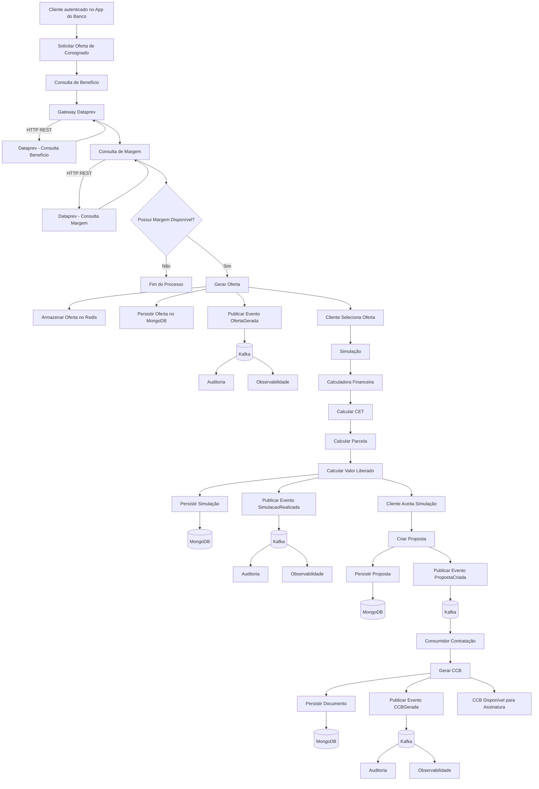

### Legenda Arquitetural

**Chamadas síncronas (HTTP REST)**

* Consulta de Benefício → Dataprev
* Consulta de Margem → Dataprev

**Mensageria Kafka**

* OfertaGerada
* SimulacaoRealizada
* PropostaCriada
* CCBGerada

**Persistência MongoDB**

* Ofertas
* Simulações
* Propostas
* Documentos (CCB)

**Redis**

* Cache da oferta diária
* Controle de TPS da Dataprev
* Rate Limiting distribuído

**Componentes transversais**

* Gateway Dataprev

  * Controle de TPS (25 TPS)
  * Circuit Breaker
  * Retry
  * Timeout
  * Observabilidade
* OpenTelemetry + Dynatrace
* Auditoria baseada em eventos Kafka

Esse fluxo representa o que normalmente acontece até a geração da CCB. Em um segundo diagrama, eu separaria a fase de **Assinatura → Averbação → Liberação de Crédito → Contrato Ativo**, porque ela costuma ser avaliada como outro processo de negócio dentro do consignado.
