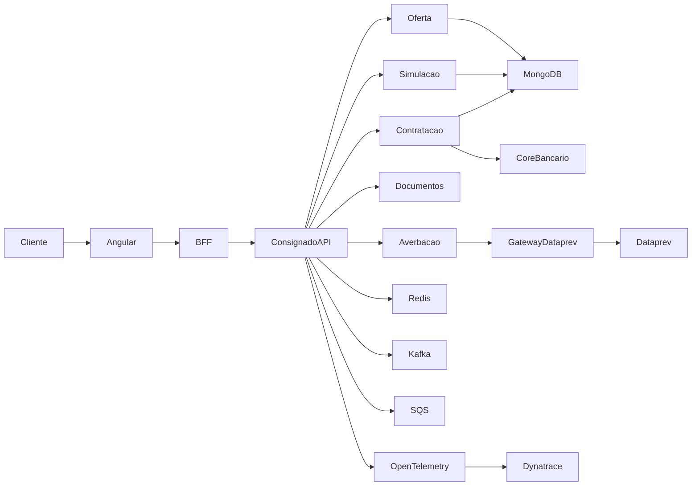
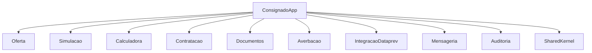
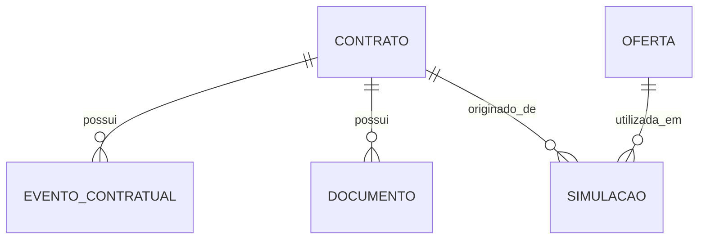
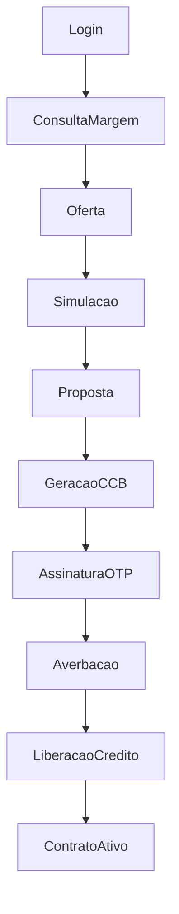
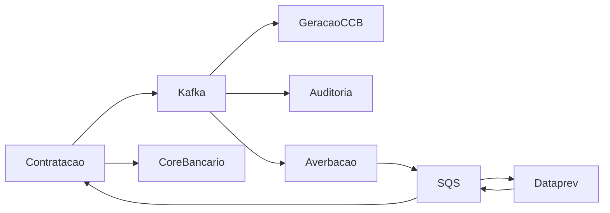
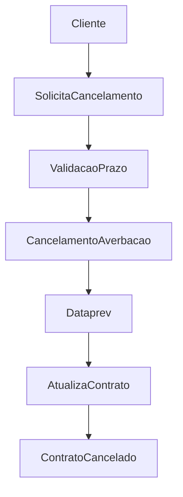

# Arquitetura de Plataforma de Crédito Consignado INSS

## 1. Objetivo do Projeto

Desenvolver uma plataforma de crédito consignado INSS para instituições financeiras, permitindo que clientes já correntistas do banco realizem a contratação de empréstimos consignados de forma totalmente digital.

A solução será responsável por realizar a consulta de margem consignável junto à Dataprev, geração de ofertas, simulações, contratação, assinatura eletrônica da CCB (Cédula de Crédito Bancário), averbação do contrato e liberação do crédito.

O sistema foi projetado utilizando conceitos de Arquitetura Hexagonal (Ports and Adapters), Domain Driven Design (DDD), mensageria assíncrona e observabilidade corporativa.

---

# 2. Objetivos de Negócio

* Digitalizar o processo de contratação de crédito consignado INSS.
* Reduzir o tempo de contratação do empréstimo.
* Automatizar integrações com a Dataprev.
* Garantir rastreabilidade completa das operações.
* Possibilitar escalabilidade futura da solução.
* Garantir observabilidade e resiliência em integrações críticas.

---

# 3. Funcionalidades Principais

## Oferta de Crédito

* Consulta de margem consignável.
* Consulta de benefício INSS.
* Geração de ofertas personalizadas.
* Armazenamento da oferta diária do cliente.

## Simulação

* Simulação de parcelas.
* Simulação de taxas.
* Simulação de prazos.
* Cálculo do CET.
* Cálculo do valor liberado.

## Contratação

* Criação de proposta.
* Geração da CCB.
* Assinatura eletrônica via OTP.
* Validação documental.
* Averbação do contrato.
* Liberação do crédito.

## Gestão Contratual

* Consulta de contratos ativos.
* Consulta de parcelas.
* Consulta de histórico contratual.
* Solicitação de cancelamento dentro do prazo legal.

## Auditoria

* Registro de todos os eventos de negócio.
* Rastreamento de alterações.
* Histórico completo da jornada do contrato.

---

# 4. Usuários e Permissões

## Cliente

### Permissões

* Consultar ofertas.
* Realizar simulações.
* Contratar empréstimos.
* Assinar contratos.
* Consultar contratos ativos.
* Consultar histórico de contratos.
* Solicitar cancelamento em até 7 dias.

### Restrições

* Não pode consultar contratos de terceiros.
* Não pode alterar contratos já averbados.

---

# 5. Regras de Negócio

### RN001

Somente clientes correntistas autenticados podem contratar consignado.

### RN002

A contratação somente pode ocorrer caso exista margem consignável disponível.

### RN003

Um cliente pode possuir múltiplos contratos ativos desde que possua margem disponível.

### RN004

Toda contratação deve gerar uma CCB.

### RN005

A assinatura da CCB deve ocorrer via OTP.

### RN006

A liberação do crédito somente ocorre após confirmação da averbação.

### RN007

O cliente possui até 7 dias para desistir da contratação.

### RN008

Todos os eventos devem ser armazenados para fins de auditoria e rastreabilidade.

### RN009

A integração com a Dataprev deve respeitar o limite máximo de TPS estabelecido.

### RN010

Falhas de integração devem ser protegidas por Circuit Breaker.

### RN011

Toda oferta gerada possui validade limitada e deve ser armazenada em cache.

### RN012

O histórico de eventos do contrato não pode ser alterado.

---

# 6. Arquitetura da Solução

## Estilo Arquitetural

* Monólito Modular
* Domain Driven Design (DDD)
* Arquitetura Hexagonal
* Event Driven Architecture
* API REST
* Processamento Assíncrono
* Observabilidade Distribuída

## Contextos de Negócio

* Oferta
* Simulação
* Calculadora Financeira
* Contratação
* Documentos
* Averbação
* Integração Dataprev
* Autenticação
* Mensageria
* Auditoria

---

# 7. Diagrama Geral da Arquitetura



---

# 8. Estrutura dos Contextos



---

# 9. Arquitetura Hexagonal

Cada contexto seguirá a estrutura:

```text
contratacao
├── api
├── application
├── domain
├── infrastructure
└── configuration
```

### API

Exposição de endpoints REST.

### Application

Implementação dos casos de uso.

### Domain

Entidades, agregados, regras de negócio e eventos.

### Infrastructure

Persistência, integrações, mensageria e componentes externos.

### Configuration

Configuração de beans, adapters e profiles.

---

# 10. Estrutura de Pacotes

```text
br.com.banco.consignado

├── oferta
├── simulacao
├── calculadora
├── contratacao
├── documentos
├── averbacao
├── integracao
│   └── dataprev
├── autenticacao
├── mensageria
├── auditoria
├── observabilidade
├── shared
└── configuration
```

---

# 11. Entidades Principais

## Contrato

```text
id
cpf
numeroContrato
valorEmprestimo
valorParcela
quantidadeParcelas
taxaJuros
cet
status
dataCriacao
```

## Simulacao

```text
id
cpf
valorSolicitado
prazo
taxa
valorParcela
cet
dataCriacao
```

## Oferta

```text
id
cpf
valorDisponivel
taxa
prazoMaximo
dataValidade
```

## Documento

```text
id
contratoId
tipoDocumento
urlDocumento
```

## EventoContratual

```text
id
contratoId
tipoEvento
payload
dataEvento
```

---

# 12. Diagrama de Entidades



---

# 13. Estrutura MongoDB

## Coleções

```text
contratos
simulacoes
ofertas
documentos
eventos_contratuais
```

Cada contexto possui sua própria coleção, reduzindo acoplamento entre domínios.

---

# 14. Endpoints REST

## Oferta

```http
GET /api/ofertas
GET /api/ofertas/{cpf}
```

## Simulação

```http
POST /api/simulacoes
GET /api/simulacoes/{id}
```

## Contratação

```http
POST /api/contratos
GET /api/contratos/{id}
GET /api/contratos/cpf/{cpf}
```

## Assinatura

```http
POST /api/contratos/{id}/assinar
POST /api/contratos/{id}/validar-otp
```

## Averbação

```http
POST /api/contratos/{id}/averbar
GET /api/contratos/{id}/averbacao
```

## Cancelamento

```http
POST /api/contratos/{id}/cancelamento
```

## Eventos

```http
GET /api/contratos/{id}/eventos
```

---

# 15. Eventos Kafka

```text
MargemConsultada
BeneficioConsultado
OfertaGerada
SimulacaoRealizada
PropostaCriada
CCBGerada
ContratoAssinado
ContratoAverbado
CreditoLiberado
ContratoCancelado
```

---

# 16. Filas AWS SQS

```text
ConsultaMargemQueue
ConsultaBeneficioQueue
AverbacaoQueue
CancelamentoAverbacaoQueue
LiberacaoCreditoQueue
```

Utilizadas para processamento assíncrono e desacoplamento de integrações externas.

---

# 17. Integração Dataprev

## Operações

* Consulta de margem consignável.
* Consulta de benefício.
* Averbação de contrato.
* Cancelamento de averbação.
* Consulta de averbações.

## Gateway Dataprev

Responsabilidades:

* Controle de TPS.
* Retry.
* Timeout.
* Circuit Breaker.
* Rate Limiting.
* Auditoria.
* Métricas.

---

# 18. Estratégia Redis

## Controle de TPS

A Dataprev possui limite operacional de TPS.

Redis será utilizado para controlar contadores distribuídos.

Exemplo:

```text
dataprev:tps:current
```

## Cache de Oferta

Oferta diária armazenada para evitar consultas repetidas.

Exemplo:

```text
oferta:{cpf}
```

## Benefícios

* Menor latência.
* Redução de chamadas externas.
* Controle centralizado de consumo.

---

# 19. Fluxo Principal



---

# 20. Fluxo Assíncrono



---

# 21. Fluxo de Cancelamento



---

# 22. Observabilidade

## Ferramentas

* OpenTelemetry
* Dynatrace SaaS

## Métricas Monitoradas

* Tempo de resposta.
* Taxa de erro.
* Chamadas Dataprev.
* Consumo Kafka.
* Consumo SQS.
* Tempo de averbação.
* Tempo de liberação de crédito.
* Disponibilidade dos serviços.

## Tracing Distribuído

Todas as chamadas REST, Kafka, SQS e integrações externas possuirão correlação por Trace ID.

---

# 23. Segurança

## Autenticação

* Login federado do banco.

## Autorização

* Controle baseado em papéis (RBAC).

## Proteções

* OAuth2
* JWT
* TLS
* Auditoria de acesso
* Mascaramento de dados sensíveis

---

# 24. Tecnologias Utilizadas

## Frontend

* Angular

## Backend

* Java 21
* Spring Boot

## Persistência

* MongoDB

## Cache

* Redis

## Mensageria

* Apache Kafka
* AWS SQS

## Cloud

* AWS

## Containers

* Docker

## CI/CD

* GitHub Actions

## Observabilidade

* OpenTelemetry
* Dynatrace SaaS

## Arquitetura

* DDD
* Arquitetura Hexagonal
* Event Driven Architecture

---

# 25. Decisões Arquiteturais

## DA001 - Monólito Modular ao invés de Microsserviços

### Decisão

Utilizar um monólito modular organizado por domínios de negócio.

### Motivação

* Menor complexidade operacional.
* Menor custo de infraestrutura.
* Facilidade de desenvolvimento.
* Deploy simplificado.
* Contextos de negócio claramente separados.

### Evolução Futura

Caso haja necessidade de escalabilidade independente, cada contexto poderá ser extraído para um microsserviço devido à separação por domínio.

---

## DA002 - MongoDB

### Decisão

Utilizar MongoDB como banco principal.

### Motivação

* Flexibilidade de schema.
* Facilidade de evolução dos documentos.
* Boa aderência ao modelo orientado a agregados do DDD.

---

## DA003 - Kafka + SQS

### Decisão

Utilizar duas tecnologias de mensageria.

### Kafka

Eventos de negócio internos.

### SQS

Integrações externas e processamento resiliente.

### Benefícios

* Desacoplamento.
* Escalabilidade.
* Resiliência.

---

## DA004 - Redis

### Decisão

Utilizar Redis para cache e controle de TPS.

### Benefícios

* Redução de latência.
* Menor consumo da Dataprev.
* Controle distribuído de limites operacionais.

---

## DA005 - Gateway Dataprev

### Decisão

Centralizar toda comunicação com a Dataprev.

### Responsabilidades

* Rate Limiting.
* Controle de TPS.
* Retry.
* Circuit Breaker.
* Observabilidade.
* Auditoria.

---

## DA006 - Observabilidade

### Decisão

Utilizar OpenTelemetry com envio para Dynatrace SaaS.

### Benefícios

* Tracing distribuído.
* Monitoramento fim a fim.
* Diagnóstico rápido de falhas.
* Métricas de negócio e técnicas.

---

# 26. Prompts Utilizados

## Ferramentas

* ChatGPT para definição da arquitetura.
* Mermaid para geração dos diagramas.

## Prompt Utilizado

"Projetar uma plataforma corporativa de crédito consignado INSS utilizando Angular, Java Spring Boot, MongoDB, Redis, Apache Kafka, AWS SQS e AWS. O sistema deve seguir os princípios de Domain Driven Design e Arquitetura Hexagonal, possuir módulos de oferta, simulação, contratação, documentos e averbação, integração com a Dataprev, observabilidade com OpenTelemetry e Dynatrace, controle de TPS, Circuit Breaker, rastreabilidade completa dos contratos e diagramas Mermaid para documentação técnica."
